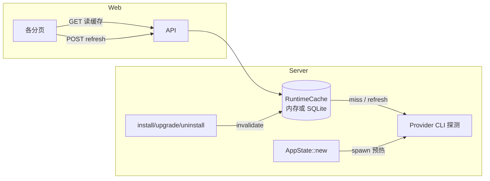

## 问题与范围

用户反馈：多个管理页 API 在请求时**同步执行命令行**探测运行时状态，页面切换/加载偏慢。期望方向：

1. 各分页增加**刷新按钮**（显式触发重算，而非每次进页都跑 CLI）
2. 服务端把探测结果**落地缓存**（内存或 SQLite）
3. **启动时**预热/刷新一次缓存

本 explore 只记录现状与改动触点，不做最终选型拍板。

## 速答

**卡顿根因在后端，不在前端。** 当前 `AppState` 无运行时缓存；每次 GET 都新建 `CursorProvider` / `PaseoProvider` 并同步 `Command`/`npm`/`git` 调用。Axum handler 虽为 `async`，但 provider 层是**阻塞式** CLI，会占住 worker 线程直到命令结束（单条最长可见 8–15s timeout）。

**前端已有「侧边栏 → 刷新当前页」**（`refreshKey` 机制），Plugin 详情另有局部「刷新」；Overview / Agents 列表 / Skills **页头无独立刷新按钮**。即便加按钮，若后端仍每次重算 CLI，体验改善有限——**核心应做服务端缓存 + 显式 refresh API**。

**SQLite 在架构文档已规划，代码里尚未引入**（无 `rusqlite` 等依赖）。现有唯一进程内状态是 Cursor 登录会话（`OnceLock<Mutex<...>>`）。启动时 `AppState::new` 只初始化 session HashSet，**不做任何探测预热**。

建议实现形态（待 design 拍板）：

| 层级 | 现状 | 与诉求差距 |
|---|---|---|
| 后端读 API | 每次请求现场 CLI | 需缓存 + 按需/启动刷新 |
| 后端写 API | 改完后未统一失效缓存 | 需在 mutation 后 invalidate |
| 前端 | 侧边栏 refreshKey；Plugin 详情有刷新 | Overview/Agents/Skills 缺页内按钮；应调服务端 refresh 而非仅重拉慢 API |
| 持久化 | 无 | SQLite 可选；Phase 1 内存 + 启动预热通常够用 |

## 关键证据

1. **`AppState` 每次调用都新建 provider，无缓存字段** — `crates/app-core/src/lib.rs:102-114,306-312`：`list_agents` / `list_plugins` / `cursor_account_status` 等直接 `self.provider()` / `self.paseo_provider()`，state 里只有 `config` 与 `sessions`。

2. **Overview 一次请求触发 agents + plugins 双份 CLI 探测** — `crates/app-core/src/lib.rs:147-173`：`overview()` 分别调用 `list_agents()` 与 `list_plugins()`；二者内部各自跑 runtime status。

3. **Cursor agent 列表/概览：已安装时同步 `agent --version`** — `crates/cursor-provider/src/lib.rs:493-557`：`agent_summary` → `agent_runtime_status` → `run_agent_command(..., &["--version"], ...)`。

4. **Paseo 插件列表：已安装时 `paseo --version` 或 `npm list -g`** — `crates/paseo-provider/src/lib.rs:134-210,446-463,521-537`：`plugin_runtime_status` 内 `read_paseo_version` / `read_paseo_version_from_npm`；Windows 下 `resolve_paseo_cli_binary` 还可能 `where paseo`（`:546-562`）。

5. **Plugin 详情最重：两条 Paseo daemon CLI（各 8s timeout）** — `crates/paseo-provider/src/lib.rs:29-41,220-240`：`plugin_detail` → `read_paseo_detail_outputs` 执行 `daemon status` 与 `daemon pair --json`。

6. **Cursor 账号页：`agent status` 同步调用** — `crates/cursor-provider/src/lib.rs:178-191`：`account_status` 在已安装时 `run_agent_command(..., &["status"], ...)`；前端 Agent 账号 tab 进页即双请求 — `apps/web/src/components/AgentDetailView.tsx:68-72`。

7. **CLI 在独立线程阻塞等待，timeout 最长 8–15s** — `crates/host-proc/src/lib.rs:44-86`：`run_command_capture_with_env_timeout` 用 `recv_timeout`；Paseo daemon 详情/动作为 8–15s — `crates/paseo-provider/src/lib.rs:230-237,107`。

8. **设置页加载也会跑 git（多子命令，无 fetch）** — `crates/app-core/src/update.rs:52-67,591-623`：`app_settings` → `read_git_state(..., false)` 连续 `git remote` / `rev-parse` / `rev-list` 等；显式「检查更新」才 `git fetch` — `:70-72`。

9. **前端 refresh 机制已存在但未覆盖所有页** — `apps/web/src/routing.ts:164-168`：`refreshKey++`；`apps/web/src/App.tsx:207-209` 侧边栏「刷新当前页」；`PluginsPage` 详情有按钮 — `apps/web/src/pages/PluginsPage.tsx:339-342`；`OverviewPage` 仅 `useEffect([refreshKey])` 拉 `/api/overview` — `apps/web/src/pages/OverviewPage.tsx:15-46`，**无页内按钮**。

10. **SQLite 仅在架构文档，代码未实现** — `.codestable/architecture/ARCHITECTURE.md:10-12` 列 SQLite；全仓 `rg sqlite|rusqlite` 无匹配。

## 细节展开

### 按 API 的 CLI/慢路径分类

| API | 主要成本 | 是否适合缓存 |
|---|---|---|
| `GET /overview` | Cursor version + Paseo version/npm | 是 |
| `GET /agents` | 同上（agents 列表） | 是 |
| `GET /plugins` | Paseo version/npm | 是 |
| `GET /plugins/:id` | `paseo daemon status` + `pair --json` | 是（最重） |
| `GET /cursor/account` | `agent status` | 是 |
| `GET /cursor/runtime` | `agent --version` | 是 |
| `GET /app/settings` | 多次本地 `git` | 可缓存（与 update check 区分） |
| `POST /app/update/check` | `git fetch` + 比较 | 保持实时（用户显式触发） |
| Profile / Skills |  mostly 文件 IO | 低优先级 |
| 登录会话 | 内存 `CursorLoginSessionState` | 已进程内，非 CLI |

### 前端刷新现状

- **全局**：侧边栏 `refresh()` 递增 `refreshKey`，各页 `useEffect` 依赖它重新 `requestJson`。
- **局部**：Plugin 详情「刷新」调用 `reloadPluginDetail` 再 GET detail；Settings 在 pull 更新成功后 `onRefresh()`。
- **缺口**：Overview、Agents 列表、Skills 页头无按钮；Agent 账号 tab 靠轮询 + 操作后手动 refresh 函数，无统一「刷新状态」入口。

用户诉求「各分页添加刷新按钮」可在 **main-header** 复用同一 `refresh` 回调，或对接新的 `POST /api/cache/refresh?scope=...`。

### 缓存落点建议（explore 级，非拍板）

**进程内 `Arc<RwLock<RuntimeSnapshot>>`**（按 key 分：`agents`、`plugins`、`plugin:{id}`、`cursor_account`、`app_settings_git`）：

- 优点：改动集中在 `app-core`，与现有 `sessions: RwLock` 一致；无新依赖。
- 缺点：重启丢失；Compose 默认无持久卷时与 SQLite 一样不跨重启——但**启动预热**可接受。

**SQLite**（`managed_base_dir` 下，如 `.local/cache.db`）：

- 优点：与 `ARCHITECTURE.md` 一致；重启可复用上次快照，启动更快。
- 缺点：需 schema、序列化、迁移；mutation 失效逻辑相同。

无论哪种，建议：

- `AppState::new` 后 `tokio::spawn` 异步预热（避免阻塞 listen）
- 新增 `POST /api/cache/refresh`（或分 scope：`overview`、`agents`、`plugins/:id`、`cursor/account`）
- `install_*` / `upgrade_*` / `uninstall_*` / `paseo daemon` 成功后 **invalidate 相关 key**
- GET 默认读缓存；可选 query `?fresh=1` 仅供调试

### 与「启动时刷新」的关系

`apps/server/src/main.rs:69-69`：`AppState::new(config)?` 后立即绑路由 listen，**无预热钩子**。启动刷新 = 在 `new` 之后、`serve` 之前或之中触发一次全量/分 scope `refresh_cache()`，与首次用户访问解耦。

## 未决问题

1. **缓存一致性**：账号登录/登出、daemon start/stop 后是否自动 invalidate，还是仅依赖用户点刷新？
2. **SQLite vs 内存**：是否需要跨进程/跨重启保留（Compose 无 mount 时价值有限）？
3. **设置页 git 信息**：是否纳入统一缓存，还是维持「检查更新」才触网？

## 后续建议

可基于本 explore 走 **feature-design**（slug 如 `runtime-status-cache`），把缓存 schema、refresh API 契约、各页按钮与 mutation 失效表写进 design + checklist。

## 相关文档

- `.codestable/architecture/ARCHITECTURE.md` — 技术栈含 SQLite，Provider 分层
- `.codestable/reference/attention.md` — 开发启动与 Compose 约定
