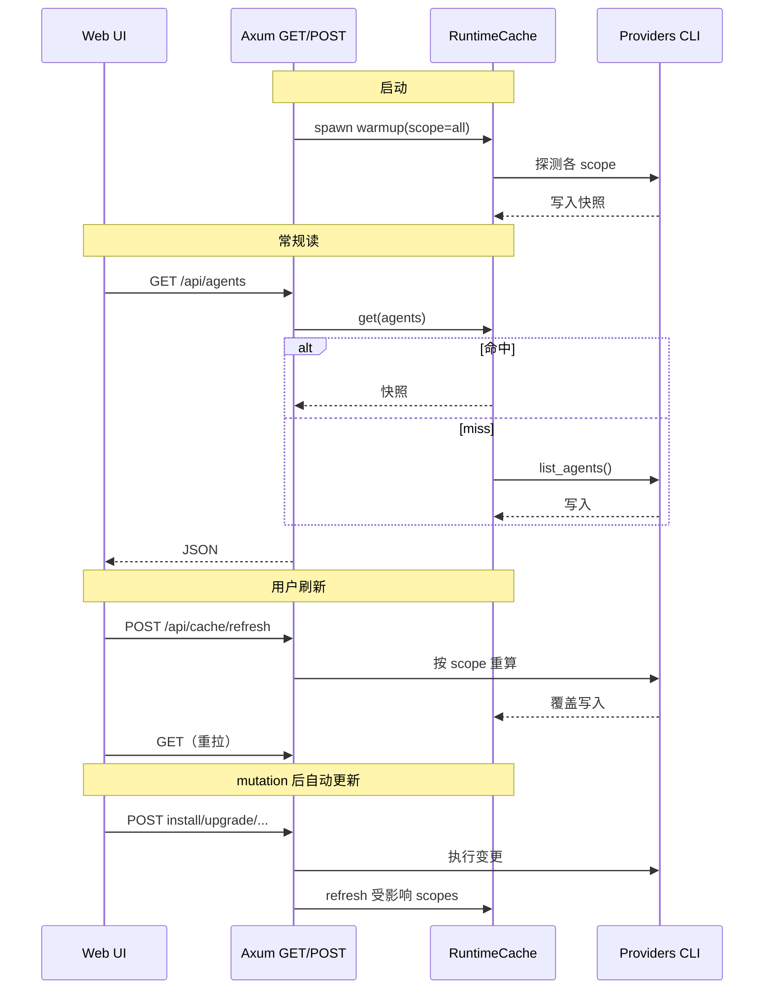

## 0. 术语约定

| 术语 | 定义 | 防冲突结论 |
|---|---|---|
| **RuntimeCache** | `AppState` 持有的进程内快照存储，按 scope 分 key，值类型与现有 GET 响应一致 | 不用 `Cache`/`StateCache` 单名，避免与 HTTP/浏览器 cache 混淆 |
| **cache scope** | 一次 refresh / invalidate 的作用域枚举 | 与前端 `refreshKey`、路由 `page` 区分命名 |
| **预热（warmup）** | 服务启动后异步触发 `scope=all` 的 refresh | 不等同于 `POST /app/update/check` |
| **自动更新** | mutation 成功后对受影响 scope **立即重算并写回** RuntimeCache | 不是仅清空 key 等下次 GET |

## 1. 决策与约束

### 需求摘要

- **做什么**：管理页读 API（agents / plugins / overview / cursor 账号与运行时 / plugin 详情）不再每次请求同步跑 CLI；改为读 RuntimeCache；用户可显式刷新；服务启动后后台预热；install/upgrade/uninstall/daemon/登录登出后自动重算受影响 scope。
- **为谁**：使用 Web 管理页运维 Cursor / Paseo 的维护者。
- **成功标准**：缓存已命中时，上述 GET 在本地开发环境**不再触发** provider 层 CLI（可用日志或探针验证）；页头「刷新」在合理时间内（允许一次 CLI 成本）更新展示；mutation 后列表/详情与真实状态一致，无需手动 F5。
- **明确不做**：
  - 不做 SQLite / 跨重启持久化（后续独立 feature）
  - **`GET /app/settings` 与其 git 逻辑维持现状**（每次加载仍 `read_git_state(..., false)`；仅 `POST /app/update/check` 做 fetch）
  - 不缓存 Skills / Profile 文件读写类 API
  - 不做 TTL 自动过期（仅 startup / 显式 refresh / mutation 三类触发重算）
  - 不删除侧边栏「刷新当前页」（可与页头按钮并存）

### 复杂度档位

走 **内部管理工具默认档位**：健壮性 L2、结构 modules、性能 reasonable（缓存即合理优化）、可读性 team。**无显著偏离**。

### 关键决策（已拍板）

| 决策 | 选择 | 换另一种做法编排层差异 |
|---|---|---|
| 存储介质 | **进程内内存**（`Arc<RwLock<RuntimeCache>>`） | SQLite 需持久化编排 + schema 迁移支线 |
| mutation 后 | **自动重算**受影响 scope | 仅 invalidate 则 GET miss 时才 CLI，mutation 后首次 GET 仍慢 |
| 设置页 git | **不纳入 RuntimeCache** | 纳入则需区分 cached git vs live fetch 两套编排 |
| GET miss | **同步计算一次并写入**（冷启动兜底） | 永远返回 503 则前端需复杂 loading 协议 |
| 预热时机 | **`AppState::new` 后 `tokio::spawn`**，不阻塞 listen | 阻塞启动则端口晚开 |

### 前置依赖

无。输入依据：`.codestable/compound/2025-06-15-explore-api-cache-refresh.md`。

## 2. 名词与编排

### 2.1 名词层

#### 现状

- `AppState`（`crates/app-core/src/lib.rs`）仅含 `config` + `sessions`；`list_agents` / `list_plugins` / `overview` / `cursor_*` / `plugin_detail` 每次调用 `CursorProvider::new()` / `PaseoProvider::new()` 现场探测。
- HTTP 路由（`apps/server/src/main.rs`）GET handler 直接调 `AppState` 方法，无缓存层。
- 前端（`apps/web/src/App.tsx`）侧边栏 `refreshKey` 触发各页 `useEffect` 重拉 GET；Plugin 详情有局部刷新按钮。

#### 变化

**新增名词**

- `RuntimeCache`：内存 map，key 为 `CacheScope`，value 为 `{ data: T, refreshed_at: DateTime<Utc> }`（`T` 与对应 API JSON 同型）。
- `CacheScope` 枚举（字符串序列化）：

| scope | 缓存内容 | 对应 GET |
|---|---|---|
| `agents` | `Vec<AgentSummary>` | `/api/agents` |
| `plugins` | `Vec<PluginSummary>` | `/api/plugins` |
| `overview` | `OverviewData` | `/api/overview` |
| `plugin:{id}` | `PluginDetail` | `/api/plugins/:id` |
| `cursor_runtime` | `CursorRuntimeStatus` | `/api/cursor/runtime` |
| `cursor_account` | `CursorAccountStatus` | `/api/cursor/account` |
| `all` | 以上全部 | （编排用，非存储 key） |

**变更接口**

1. **`POST /api/cache/refresh`**（需登录）

```json
// 请求
{ "scope": "overview" }
// 或 { "scope": "plugin", "plugin_id": "paseo" }
// 或 { "scope": "all" }

// 响应 200
{ "message": "已刷新 overview 缓存" }

// 响应 400 — 未知 scope
{ "error": "未知 cache scope" }
```

`// 来源：apps/server/src/main.rs 路由风格；host_model::ActionMessage`

2. **现有 GET**（`/overview`、`/agents`、`/plugins`、`/plugins/:id`、`/cursor/runtime`、`/cursor/account`）：编排改为 `RuntimeCache.get_or_compute(scope)`，**不新增响应字段**。

3. **前端页头刷新**：`main-header` 增加按钮；点击 → `POST /api/cache/refresh`（当前页对应 scope）→ 递增 `refreshKey` 或重拉 GET。

**不在范围内变更**

- `GET /app/settings`、`POST /app/update/check` 行为不变。
- `GET /cursor/login/status` 仍读进程内 `CursorLoginSessionState`（已有内存态）。

### 2.2 编排层

#### 主流程图



#### 现状

线性：**请求 → AppState 方法 → Provider CLI/FS → 响应**。mutation 后不触碰任何快照。

#### 变化

1. **读路径**：GET → `RuntimeCache.get_or_compute` → 命中则直接返回；miss 则调用现有 AppState 探测逻辑写 cache 后返回。
2. **预热路径**：`main` 在 `AppState::new` 成功后 `tokio::spawn` 调用 `refresh_cache(all)`；失败记 log，不阻止服务启动。
3. **显式 refresh 路径**：`POST /api/cache/refresh` → 解析 scope → 调用与 warmup 相同的 `refresh_cache` 子集 → 返回 `ActionMessage`。
4. **mutation 自动更新路径**：下列 API 在**成功返回前**对表内 scope 调用 `refresh_cache`（同步，接受一次 CLI 成本）：

| mutation API | 刷新 scope |
|---|---|
| `/agents/:id/install\|upgrade\|uninstall` | `agents`, `overview`, `cursor_runtime`, `cursor_account` |
| `/plugins/:id/install\|upgrade\|uninstall` | `plugins`, `overview`, `plugin:{id}` |
| `/plugins/:id/daemon/:action` | `plugin:paseo`, `plugins` |
| `/cursor/runtime/install\|upgrade` | `cursor_runtime`, `agents`, `overview` |
| `/cursor/login/start`（started） | `cursor_account` |
| `/cursor/logout` | `cursor_account` |

5. **overview 编排**：`overview` scope 刷新时**一次**重算 agents + plugins 并组装 `OverviewData`，避免 GET `/overview` 与 GET `/agents` 各跑一遍 CLI。

#### 流程级约束

- **并发**：同一 scope 刷新中再次 refresh → 后者等待或合并（implement 二选一，须保证不并发双 CLI）；读路径 miss 与 refresh 竞态时以 RwLock 保证单次写入。
- **错误语义**：refresh 单 scope 失败 → 保留旧快照（若有），POST 返回 500 + error；GET miss 且 compute 失败 → 沿用现有 API 错误行为。
- **幂等**：重复 `POST refresh` 相同 scope 可安全执行。
- **可观测**：refresh 完成打 `info!(scope, elapsed_ms)` 日志。

### 2.3 挂载点清单

| 挂载位置 | 动作 |
|---|---|
| `apps/server/src/main.rs` — 路由表 | **新增** `POST /api/cache/refresh` |
| `apps/web/src/App.tsx` — `main-header` | **新增** 页级「刷新」按钮（调用 refresh API + 现有 `refresh()`） |
| `crates/app-core` — `AppState` 构造 | **修改** 挂载 `RuntimeCache` + 启动 warmup 钩子（由 server `main` spawn） |

Skills / Settings 页头按钮同样走 `App.tsx` header，但 Settings 的 refresh **只** `refreshKey` 重拉 settings（不调 cache API）。

### 2.4 推进策略

1. **编排骨架**：新增 `RuntimeCache` + scope 枚举 + stub `get_or_compute` / `refresh_cache`；GET 改走 cache；POST refresh 路由注册。  
   **退出信号**：编译通过；GET 仍返回数据（可先 passthrough 到旧逻辑）。

2. **计算节点 — 后端 cache 填充**：实现各 scope 的真实探测与 `overview` 组装；startup warmup spawn。  
   **退出信号**：重启服务后日志见 warmup；二次 GET `/agents` 无新增 CLI（探针/日志）。

3. **计算节点 — mutation 自动 refresh**：在列出的 mutation 成功路径挂 refresh 表。  
   **退出信号**：install plugin 后 GET list 立即反映，无需手动刷新。

4. **前端 — 页头刷新**：header 按钮 + 各页 scope 映射 + 调用链。  
   **退出信号**：Overview / Agents / Plugins / Skills / Settings 页头可见按钮；点击后数据更新。

5. **联调与 compose 验收**：`scripts/compose-check.bat` 或 dev 手工走关键场景。  
   **退出信号**：第 3 节场景清单均可观察通过。

### 2.5 结构健康度与微重构

##### 评估

- **文件级 — `crates/app-core/src/lib.rs`**（~340 行）：本次需改 AppState 构造与多个读/mutation 编排入口；若 cache 逻辑全写入会混「HTTP 编排 + cache 细节」。
- **文件级 — `apps/server/src/main.rs`**（~510 行）：仅增 1 个 handler + 1 路由，改动密度低。
- **目录级 — `crates/app-core/src/`**：现有 `lib.rs` + `update.rs`；新增 `runtime_cache.rs` 与 `update.rs` 并列，目录未摊平（2→3 文件）。

##### 结论：不做前置微重构

cache 逻辑作为 **feature 主体** 落在新建 `crates/app-core/src/runtime_cache.rs`，`lib.rs` 只保留委托调用。无需先拆 `lib.rs` 其他职责。

##### 超出范围的观察

- `apps/server/src/main.rs` 已 500+ 行且 handler 密集 → 后续可考虑 `cs-refactor` 拆 `routes/` 模块；**本 feature 不阻塞**。

## 3. 验收契约

### 关键场景清单

| # | 输入 / 触发 | 期望可观察结果 |
|---|---|---|
| 1 | 服务启动完成，未打开页面 | 日志出现 warmup；稍后 GET `/api/agents` 快速返回 |
| 2 | 缓存已预热，GET `/api/agents` 两次 | 第二次无明显延迟；provider CLI 不被重复调用（日志/探针） |
| 3 | 点击 Overview 页头「刷新」 | POST refresh scope=overview 成功 → 概览数据更新 |
| 4 | POST install/upgrade/uninstall agent | 成功后 agents 列表与 overview 自动一致，无需 F5 |
| 5 | POST plugin daemon restart | plugin 详情 daemon 字段更新 |
| 6 | Cursor 登出成功 | account 状态变为未登录 |
| 7 | GET `/app/settings` | 仍执行本地 git 读（行为与改前一致）；**不**出现 RuntimeCache 相关 log |
| 8 | POST `/app/update/check` | 仍触发 git fetch；与 cache 无关 |
| 9 | POST refresh 未知 scope | 400 + error JSON |
| 10 | 服务刚启动、warmup 未完成时 GET | 仍返回正确数据（miss 同步计算兜底），不 503 |

### 明确不做的反向核对

- 仓库中**不应**出现 `rusqlite` / SQLite cache 实现。
- `GET /app/settings` **不应**改为读 RuntimeCache。
- **不应**删除侧边栏「刷新当前页」按钮。

## 4. 与项目级架构文档的关系

acceptance 后建议在 `ARCHITECTURE.md` **运行时管理** 小节补充一句：读路径经 `RuntimeCache` 进程内快照，CLI 探测由 warmup / 显式 refresh / mutation 触发。

本 feature 系统级可见变化：**新增 HTTP 挂载点** + **AppState 多一个 RuntimeCache 名词**；Provider 层签名不变。

---

> **整体 review 提示**
> 1. 术语是否与现有概念冲突？
> 2. 决策与「不做什么」是否准确？
> 3. 名词层 scope 表与接口示例是否够用？
> 4. mutation → scope 映射是否遗漏？
> 5. 挂载点能否支撑卸载？
> 6. 验收场景是否覆盖边界？
>
> 确认后将 `status` 改为 `approved`，再进入 `cs-feat-impl`。
