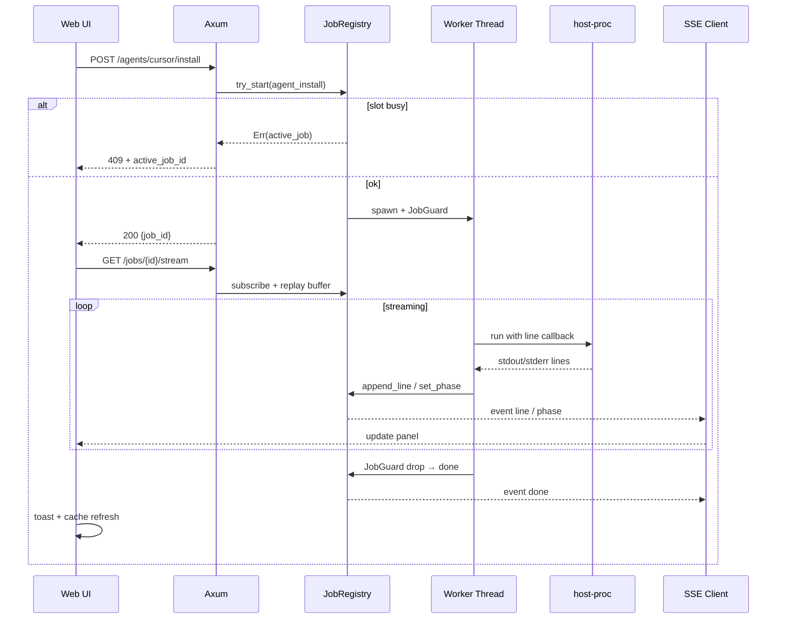

## 0. 术语约定

| 术语 | 定义 | 防冲突结论 |
|------|------|-----------|
| **Command Job** | 一次由 Web 触发的、需观察 CLI 输出的长任务 | 不叫 `task` / `background-task`（避免与 Cursor task 混淆）；API 路径用 `/api/jobs` |
| **JobRegistry** | 进程内单槽任务注册表，负责 try-start / 槽位释放 / SSE 广播 | 与 `update.rs` 的 `UpdateJobState` 并存（v1 不合并） |
| **JobKind** | 任务类型标识，如 `skills_cli_install`、`plugin_install` | 不叫 `action`（与 daemon action 参数区分） |
| **Job stream** | `GET /api/jobs/:id/stream` 的 SSE 事件流 | 不叫 `terminal` / `shell` |
| **line event** | SSE 推送的单行 stdout/stderr（已剥离 ANSI） | 与 `AppUpdateStatus.output` 累积字符串区分 |

## 1. 决策与约束

### 需求摘要

- **做什么**：抽取共用 **Command Job** 能力——安装 / 升级 / 卸载 / 启动（daemon）/ 更新类 CLI 操作启动后立即返回 `job_id`，前端经 **SSE** 实时展示 phase 与命令输出；**全局同时仅 1 个**长任务，并防死锁。
- **为谁**：通过 Web 管理页运维容器内 Cursor、Plugin、Skill 的维护者。
- **成功标准**：
  - 触发纳入范围的操作后 **1s 内** 拿到 `job_id` 且日志面板开始滚动。
  - 另一操作进行中再触发 → **409** + 当前 `active_job_id`，不阻塞 HTTP。
  - 任务结束 SSE 推送 `done` 事件，含成功/失败与业务结果摘要；失败时日志保留 stderr。
  - 服务重启后无僵死占槽（in-process job 清空；update 仍走现有恢复逻辑）。
- **明确不做（v1）**：
  - **不做** 交互式终端 / 任意 shell / stdin 输入
  - **不做** 多任务并行、任务历史列表、持久化 job 日志到磁盘
  - **不做** Cursor / GitHub 登录轮询、账号状态探测的输出展示
  - **不做** `update.rs` 迁入 Command Job（设置页保留现有轮询；第二期再迁）
  - **不做** Skills `find` / 纯秒回 GET 的 job 化

### 复杂度档位

走 **内部管理工具默认档位**。偏离项：

| 维度 | 档位 | 偏离原因 |
|------|------|---------|
| Concurrency | thread-safe + 单槽互斥 | 全局仅 1 job，但 SSE 多订阅者需 broadcast |
| Idempotency | non-idempotent | 安装类操作本身非幂等；靠 409 挡重复触发 |

### 关键决策

| 决策 | 选择 | 换另一种做法编排层差异 |
|------|------|----------------------|
| API 形态 | **保留各领域 POST 路径**，响应改为 `{ job_id, kind, label }`；新增通用 `/api/jobs/*` | 统一 `POST /api/jobs` 需前端改所有调用点为同一入口 + 大 params 联合类型 |
| 输出通道 | **SSE 结构化事件**（`line` / `phase` / `done` / `error`） | 轮询快照需高频 GET + 全量 output，实时感弱 |
| Crate 边界 | 新建 **`host-jobs`**；`host-proc` 增流式执行；`app-core` 持 Registry | 全塞 `app-core` 会继续膨胀 |
| 单槽互斥 | **JobRegistry.try_start** 唯一闸口；**移除** `skills_cli::INSTALL_LOCK` | 双锁有死锁风险 |
| 背压 | worker → SSE 用 **unbounded** channel | 有界 channel 慢客户端会堵 pipe |
| 取消 | v1 提供 **`POST /api/jobs/:id/cancel`**（SIGTERM 子进程 + 释放槽位） | 无取消则长 npm 只能等超时 |
| 超时 | **按 JobKind 配置**（默认 120s；Cursor 官方安装脚本 300s） | 全局统一超时对某些命令过短或过长 |
| ANSI | **host-jobs 层统一 strip**（从 `skills_cli` 抽出工具函数到 `host-proc`） | 各 provider 各自处理不一致 |
| skills-cli-install | **变更** preview/install 为异步 job（**破坏**原同步响应契约） | 保留同步则无法流式，与 feature 目标冲突 |

### 前置依赖

- `2026-06-15-skills-cli-install` 已实现同步 API；本 feature **重构**其 preview/install 为 job 模式，并改 `SkillsInstallDialog` 消费 SSE。

## 2. 名词与编排

### 2.1 名词层

#### 现状

- **命令执行**：`host-proc::run_command_capture_with_env_timeout` 阻塞至进程结束，一次性返回合并 stdout+stderr（`crates/host-proc/src/lib.rs`）。
- **更新任务**：`app-core::update` 独立 `UpdateJobState` 文件 + 轮询 `GET /api/app/update/status`（`crates/app-core/src/update.rs`）；设置页 `pollUpdateJob` 2s 轮询（`apps/web/src/pages/SettingsPage.tsx`）。
- **Skills CLI**：preview/install 同步 HTTP + `INSTALL_LOCK` mutex（`crates/cursor-provider/src/skills_cli.rs`）。
- **Agent/Plugin 操作**：`POST /api/agents/:id/install|upgrade|uninstall`、`POST /api/plugins/:id/...` 同步返回 `RuntimeActionResult`（`apps/server/src/main.rs`）。
- **前端**：各页本地 `installing` / `pullingUpdate` 布尔态，无共用日志组件。

#### 变化

**新增 crate `host-jobs`**（依赖 `host-proc`、`host-model`）：

| 类型 | 职责 |
|------|------|
| `JobRegistry` | 单槽 `try_start` / `snapshot` / `cancel` / `subscribe_stream` |
| `JobGuard` | worker 线程 RAII：终态 + 释放槽位 + 发 `done` |
| `JobContext` | `append_line(stream, text)`、`set_phase(phase, message)` |
| `JobKind` | 枚举或常量字符串表 + per-kind `timeout` |

**`host-model` 新增契约**：

```json
// CommandJobStartResponse — 各领域 POST 成功启动后统一返回
// 来源：host-model CommandJobStartResponse
{
  "job_id": "550e8400-e29b-41d4-a716-446655440000",
  "kind": "skills_cli_install",
  "label": "安装 Skill"
}

// 409 — 槽位被占
{
  "error": "另一个命令任务正在进行",
  "active_job_id": "...",
  "kind": "plugin_install",
  "label": "安装 Paseo"
}

// GET /api/jobs/current — 200，无活跃任务时 active=false
{
  "active": true,
  "job_id": "...",
  "kind": "agent_install",
  "label": "安装 Cursor",
  "phase": "running",
  "message": "正在执行安装脚本…"
}

// GET /api/jobs/:id — 快照（重连 / 未开 stream 时）
{
  "job_id": "...",
  "kind": "...",
  "label": "...",
  "active": true,
  "phase": "running",
  "message": "...",
  "line_count": 42
}
```

**SSE 事件**（`Content-Type: text/event-stream`）：

```
event: phase
data: {"phase":"running","message":"正在执行 npx skills add…"}

event: line
data: {"stream":"stderr","text":"npm warn …"}

event: done
data: {"success":true,"message":"已安装 2 个 skill","result":{…}}

event: error
data: {"message":"命令超时（120s）"}
```

- `line.text` 已剥离 ANSI；`stream` 为 `stdout` | `stderr`。
- `done.result` 形状随 `kind` 变化（如 `RuntimeActionResult`、`SkillsCliInstallResult`、`ActionMessage`）；失败时 `success:false`，`result` 可省略。

**`host-proc` 新增**：

```rust
// 概念签名 — implement 自决具体类型
run_command_with_line_callback(program, args, cwd, env, timeout, |stream, line| { ... })
```

**变更的领域 POST**（响应从同步结果 → `CommandJobStartResponse`）：

| 端点 | JobKind |
|------|---------|
| `POST /api/profile/skills/cli/preview` | `skills_cli_preview` |
| `POST /api/profile/skills/cli/install` | `skills_cli_install` |
| `POST /api/agents/:id/install\|upgrade\|uninstall` | `agent_install` / `agent_upgrade` / `agent_uninstall` |
| `POST /api/plugins/:id/install\|upgrade\|uninstall` | `plugin_install` / `plugin_upgrade` / `plugin_uninstall` |
| `POST /api/plugins/:id/daemon/:action` | `plugin_daemon`（action 入参） |

**新增通用端点**（均需登录）：

| 端点 | 作用 |
|------|------|
| `GET /api/jobs/current` | 当前槽位快照 |
| `GET /api/jobs/:id` | 指定 job 快照 |
| `GET /api/jobs/:id/stream` | SSE 流（先回放内存 buffer，再 live） |
| `POST /api/jobs/:id/cancel` | 取消：杀子进程、标 `failed`、释放槽位 |

**前端新增**（`apps/web/src/`）：

| 件 | 职责 |
|----|------|
| `hooks/useCommandJob.ts` | 启动 job、订阅 SSE、聚合 lines、处理 409/done |
| `components/CommandJobPanel.tsx` | phase + 自动滚动 `<pre>` 日志 |
| `context/CommandJobContext.tsx`（或 App 内 provider） | 全局当前 job 态，跨页展示面板 |

### 2.2 编排层

#### 主流程图



#### 现状

长 CLI 操作：**HTTP 同步阻塞** → 完成后一次性返回 message；仅 update 例外（后台 worker + 轮询 output 字符串）。

#### 变化

1. **启动路径**：领域 POST handler 调用 `AppState::start_*_job(...)` → `JobRegistry::try_start` → 立即 JSON 返回 `job_id`。
2. **执行路径**：worker 线程内用 `host-proc` 流式读行 → `JobContext::append_line` → unbounded broadcast → SSE handler 转发。
3. **观察路径**：前端 `useCommandJob` 打开 EventSource；断线可重连同一 `job_id`（服务端 replay buffer）。
4. **结束路径**：`JobGuard::drop` 写终态、发 `done`、释放槽位；成功时由 job 完成回调触发既有 `RuntimeCache` 刷新（与现 mutation 后 refresh 一致）。
5. **取消路径**：`POST cancel` → kill 子进程 handle → `phase=failed` → 释放槽位。
6. **启动恢复**：`AppState::new` 时 `JobRegistry` 为空槽；**不**持久化 in-process job。`update::recover_stale_update_job_on_startup` 保持独立。

#### 流程级约束

| 约束 | 规则 |
|------|------|
| 单槽 | `try_start` 失败即 409，**永不**在 handler 内 `lock().await` 等 worker |
| 死锁 | 唯一闸口 JobRegistry；无 `INSTALL_LOCK`；channel 必须 unbounded |
| RAII | worker 包 `catch_unwind`；`JobGuard` drop 必释放槽位 |
| 超时 | 超时杀进程 → `error` 事件 + `done success=false` |
| 错误语义 | CLI 非零退出 → `done success=false`，日志保留；**不**假装成功 |
| 幂等 | 重复点击由 UI disable + 409 双保险 |
| 可观测 | `info!(job_id, kind, elapsed_ms, success)` |
| update | v1 **不接入** Registry；设置页逻辑不变 |

### 2.3 挂载点清单

| 挂载位置 | 动作 |
|---------|------|
| `Cargo.toml` workspace + `crates/host-jobs` | **新增** crate 成员 |
| `apps/server/src/main.rs` — `/api/jobs/*` 路由 | **新增** current / snapshot / stream / cancel |
| `apps/web/src/App.tsx` | **修改** 挂载 `CommandJobProvider` + 全局 `CommandJobPanel` |
| 各 mutation 页（`SkillsInstallDialog`、`AgentsPage`、`PluginsPage` 等） | **修改** 长操作改调 `useCommandJob`（Settings 页 update **暂不改**） |

### 2.4 推进策略

1. **编排骨架**：`host-jobs` + `host-proc` 流式 stub + job API 路由 stub + 前端 Panel 壳 → cargo/web build 通过，stub job 可返回假 `job_id`
2. **计算节点（后端核心）**：JobRegistry 单槽、SSE、broadcast、cancel、超时、RAII、启动空槽
3. **计算节点（后端接入）**：Skills preview/install → Paseo/Cursor/GH install/upgrade/uninstall/daemon
4. **计算节点（前端）**：`useCommandJob` + 各页接入 + 409 处理
5. **联调验收**：覆盖第 3 节场景；确认 update 页仍轮询正常

### 2.5 结构健康度与微重构

##### 评估

- **文件级 — `crates/app-core/src/lib.rs`**：约 750+ 行，职责已偏多（AppState 门面 + cache + 多 provider 委托）；本次仅加 `JobRegistry` 字段与薄封装，**+3 处以内**。
- **文件级 — `apps/server/src/main.rs`**：约 640 行，路由 + handler 混杂；本次 +4 路由，不拆文件。
- **文件级 — `crates/cursor-provider/src/lib.rs`**：约 940 行，偏重；job 逻辑应留在 `skills_cli.rs` 调 Registry 回调，不继续膨胀 `lib.rs`。
- **目录级 — `apps/web/src/components/`**：现 5 个顶层组件 + `plugins/` 子目录；新增 `CommandJobPanel` + `context/` 或 `hooks/` 可接受（<8 同层文件）。
- **compound convention**：未命中目录组织 convention。

##### 结论：不做

本次新增代码 **优先落 `host-jobs` 新 crate** 与 `hooks/` / `components/CommandJobPanel`，不前置微重构。`app-core/lib.rs` 与 `main.rs` 仅最小接入。

##### 超出范围的观察

- `crates/app-core/src/lib.rs`、`apps/server/src/main.rs`：持续膨胀，职责混杂 → 建议后续 `cs-refactor` 拆 `server` handlers 与 `app-core` 域模块；**不阻塞本 feature**。

## 3. 验收契约

### 关键场景清单

| # | 输入 / 触发 | 期望可观察结果 |
|---|------------|---------------|
| 1 | Skills 安装合法 source + 勾选 | POST install 立即返回 `job_id`；面板逐行出现 npx 输出；`done.success=true`；Skills 列表刷新 |
| 2 | Skills preview 慢仓库 | 同上有 `job_id` + 流式日志；`done.result.skills` 可解析 |
| 3 | Cursor agent install | 日志可见安装脚本输出；完成后 agent 卡显示已安装 |
| 4 | Paseo plugin install | npm 输出流式可见；完成后 plugin 已安装 |
| 5 | Paseo daemon start | 日志 + `done`；daemon 状态变 running |
| 6 | GH plugin install | 下载/解压日志可见（若 CLI 有输出）；安装成功 |
| 7 | job A 运行中触发 job B | B 返回 **409** + `active_job_id`；UI 提示并可选跳转当前日志 |
| 8 | 运行中 POST cancel | 日志停止；`done.success=false`；槽位释放；可立即发起新 job |
| 9 | SSE 中途断开再连同一 `job_id` | 先收到 buffer 回放，再收 live 行 |
| 10 | CLI 非零退出 | `done.success=false`；stderr 行在面板可见；toast 错误 |
| 11 | 超时（可用极短 timeout 测） | `error` 事件；进程被杀；槽位释放 |
| 12 | 设置页拉取并构建 | **仍**走原轮询 + `update-log`；行为与改前一致 |

### 明确不做的反向核对项

| 不做项 | 核对方式 |
|--------|---------|
| 交互式终端 | 无 stdin WebSocket；无 `/api/terminal` |
| 多任务并行 | 第二个 job 必 409；无任务队列 API |
| 任务历史 | 无 `GET /api/jobs` 列表；无磁盘 job 日志 |
| 登录轮询输出 | `cursor/login`、`gh/login` 路由响应形不变，无 job_id |
| update 迁入 | `update.rs` 无 JobRegistry 引用；`GET /api/app/update/status` 仍存在 |
| Skills find | 仍无 find 路由 |

## 4. 与项目级架构文档的关系

acceptance 后建议更新 `architecture/ARCHITECTURE.md`：

- **名词**：Command Job / JobRegistry / SSE job stream 端点表
- **动词骨架**：长 CLI mutation「启动 → 流式观察 → done → cache refresh」替代原同步阻塞描述
- **约束**：全局单槽、非终端托管边界、与 update job 并存说明

关联现有：`runtime-status-cache`（mutation 后 refresh）、`skills-cli-install`（install API 契约变更需同步 architecture §6.2 编排描述）。

本 feature 引入 **系统级可见** 新子系统 `host-jobs`，非纯内部重构。
