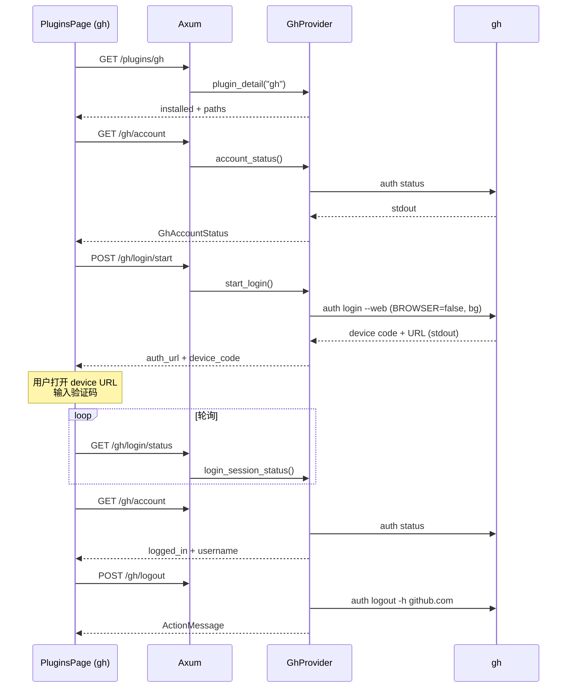

## 0. 术语约定

| 术语 | 定义 | 防冲突结论 |
|---|---|---|
| **gh** | GitHub 官方 CLI（`gh` 命令） | plugin id 固定为 `gh`；不叫 `github` / `github-cli` 作 id |
| **GitHub.com** | 公有云 GitHub 实例 | v1 仅 `github.com`；不叫「默认实例」含糊指代 GHE |
| **device flow** | `gh auth login --web` + `BROWSER=false` 输出的验证码 + `https://github.com/login/device` | 不叫 OAuth 泛称；API 字段用 `device_code` / `auth_url` |
| **GhAccountStatus** | 从 `gh auth status` 解析的登录快照 | 与 `CursorAccountStatus` 并列，不共用类型（note 字段语义不同） |

## 1. 决策与约束

### 需求摘要

- **做什么**：在 Plugins 页新增 **GitHub CLI（gh）** 插件——支持官方方式安装/升级/卸载；已安装后进入详情页管理 **GitHub.com 授权**（登录状态、用户名、发起 Web 登录、展示 device 链接与验证码、注销），交互对标 Cursor Agent 详情「账号」tab。
- **为谁**：通过 agent-manager Web 在容器/受管环境中运维 GitHub CLI 的部署者。
- **成功标准**：
  - Plugins 列表出现 gh 卡片；未安装时展示官方安装命令；点击安装后 `gh --version` 可用。
  - 详情页可查看登录状态；未登录时可「登录」并看到 device URL + 一次性验证码；用户在外部浏览器完成后本页自动变为已登录且显示用户名。
  - 已登录时可「注销」，`gh auth status` 显示未登录。
- **明确不做**（用户拍板）：
  - **不做** GitHub Enterprise Server / 自定义 hostname
  - **不做** PAT / `--with-token` 粘贴登录
  - **不做** `gh` 业务能力 UI（repo / PR / issue 列表等）
  - **不做** 详情页展示 `gh auth status` 原始文本（仅结构化字段）
  - **不做** gh 配置文件（`~/.config/gh/config.yml`）的可视化编辑

### 复杂度档位

走 **内部管理工具默认档位**。偏离点：需新建 `gh-provider` crate 并在 `app-core` 增加 plugin 路由（避免继续堆进 `paseo-provider`）。

### 关键决策（已拍板）

| 决策 | 选择 | 换另一种做法编排层差异 |
|---|---|---|
| 授权实例 | 仅 **github.com** | GHE 需 hostname 表单 + `gh auth login -h` 分支 |
| 登录方式 | **Web device flow**（`BROWSER=false`） | PAT 需输入框 + `--with-token` + 密钥展示策略 |
| 详情范围 | **仅授权管理** | 原始 status 输出需额外 Panel + 刷新策略 |
| Provider 落点 | 新建 **`gh-provider`**；`app-core` 按 `plugin_id` 路由 | 全塞 `paseo-provider` 则 daemon/gh 职责混杂 |
| 授权 API 路径 | **`/api/gh/*`**（平行于 `/api/cursor/*`） | 嵌套 `/api/plugins/gh/auth/*` 更深但无必要 |
| 安装来源 | **官方渠道**：Unix 用 GitHub 发布 tarball 解压到受管目录；Windows 展示 `winget` 命令 | 非官方 curl 脚本增加供应链风险 |

### 前置依赖

无 feature 级阻塞。运行时镜像已有 `curl`/`bash`（`Dockerfile` runtime stage），满足 tarball 安装。

## 2. 名词与编排

### 2.1 名词层

#### 现状

- Plugin 注册表：`host-fs::SUPPORTED_PLUGINS` 仅含 Paseo（`crates/host-fs/src/lib.rs`）。
- Plugin 生命周期（list/install/upgrade/uninstall/detail）：全部由 `paseo-provider` 实现；`app-core` 统一委托 `paseo_provider()`（`crates/app-core/src/lib.rs`）。
- Plugin 详情 UI：`PluginsPage` 内联 `PluginDetailView` **硬编码 Paseo**（daemon 状态 / pair 链接）（`apps/web/src/pages/PluginsPage.tsx`）。
- Cursor 授权模型与 API：`CursorAccountStatus`、`CursorLoginStartResult`、`CursorLoginSessionStatus`；路由 `/api/cursor/account|login/start|login/status|logout`（`crates/host-model`、`apps/server/src/main.rs`）；`cursor-provider` 后台 `agent login` + stdout 解析 auth URL（`crates/cursor-provider/src/lib.rs`）。

#### 变化

**1. Plugin 注册（host-fs）**

在 `SUPPORTED_PLUGINS` 追加：

| 字段 | 值 |
|---|---|
| `id` | `gh` |
| `name` | `GitHub CLI` |
| `official_url` | `https://cli.github.com/` |
| `install_command` | 平台相关：`gh_cli_install_command()`（Windows → `winget install --id GitHub.cli`；Unix → 官方 Debian apt 一行说明，供 UI 展示） |
| `default_workspace` | `""`（gh 无工作区概念） |
| `data_dir` | `~/.config/gh`（`plugin_home_dir` 对 gh 特判为 `home.join(".config").join("gh")`） |

**2. 新增 Gh 授权契约（`/api/gh/*`，均需管理页登录）**

`GET /api/gh/account` → `GhAccountStatus`

```json
{
  "logged_in": true,
  "username": "octocat",
  "hostname": "github.com",
  "note": "GitHub CLI 账号信息由 `gh auth status` 做 best-effort 解析。"
}
```

`GET /api/gh/auth-flow` → `GhAuthFlowStatus`（结构同 `CursorAuthFlowStatus`：summary + steps）

`POST /api/gh/login/start` → `GhLoginStartResult`

```json
{
  "started": true,
  "already_logged_in": false,
  "auth_url": "https://github.com/login/device",
  "device_code": "ABCD-1234",
  "message": "请在浏览器打开链接并输入验证码。"
}
```

`GET /api/gh/login/status` → `GhLoginSessionStatus`（`active` / `auth_url` / `device_code` / `message` / `error`）

`POST /api/gh/logout` → `ActionMessage`

**3. 既有 Plugin API 不变路径，扩展 gh 分支**

- `GET /api/plugins` — 列表含 gh
- `POST /api/plugins/gh/install|upgrade|uninstall` — 由 `gh-provider` 执行
- `GET /api/plugins/gh` — gh 已安装时返回精简 `PluginDetail`（Paseo 专有字段对 gh 填空串）；授权信息走 `/api/gh/account`

**不在范围内变更**

- Paseo daemon API 与 UI 行为不变。
- Cursor 授权 API 不变。
- `PluginDetail` 结构体暂不拆分（gh 详情页不依赖 `daemon_*` 字段）。

### 2.2 编排层

#### 主流程图



#### 现状

Plugin 安装后仅 Paseo 有详情交互；无 gh 概念。Cursor 授权是独立子系统，与 Plugin 生命周期解耦。

#### 变化

1. **安装路径**：用户点「安装」→ `gh-provider::install_plugin` 下载官方 release tarball（linux amd64 / 按 `TARGET` 选架构）解压到受管目录（如 `~/.local/share/gh`）并确保 `gh` 在 PATH；升级重复拉 latest；卸载删二进制保留 `~/.config/gh`。
2. **授权路径**：对标 Cursor——`start_login` 后台 spawn `gh auth login --hostname github.com --git-protocol https --web --skip-ssh-key`，环境变量 `BROWSER=false`（及必要时 `GH_FORCE_TTY=1`）；解析 stdout 中 `https://github.com/login/device` 与 `XXXX-XXXX` 验证码；子进程结束后以 `gh auth status` 判定成败。
3. **读路径缓存**：`RuntimeCache` 新增 `gh_account` 快照；登录 session `active` 时跳过缓存直读；mutation 后 `after_gh_account_mutation` 刷新（平行 `cursor_account`）。
4. **前端路径**：`pluginId === "gh"` 时渲染 `GhPluginDetailView`（账号 Panel + 登录/注销 + device 链接与验证码）；`pluginId === "paseo"` 保留现有视图。

#### 流程级约束

- **超时**：`gh auth login` 子进程最长 10 分钟；超时标记 session error。
- **并发**：同一时刻仅允许一个 gh login session（mutex，平行 Cursor）。
- **幂等**：重复 `logout` 在未登录时返回友好 message，不 500。
- **错误语义**：CLI 非零退出 → session `error` 含 stderr 摘要；安装失败不写入「已安装」缓存。
- **可观测**：login 完成 / install 完成打 `info!(plugin_id="gh", username?, elapsed_ms)`。

### 2.3 挂载点清单

| 挂载位置 | 动作 |
|---|---|
| `host-fs::SUPPORTED_PLUGINS` + `gh_cli_install_command()` | **新增** gh 注册与安装命令展示 |
| `crates/gh-provider/` | **新增** crate：install + auth 编排 |
| `crates/app-core` — plugin / gh 委托与缓存 | **扩展** 按 `plugin_id` 路由；`gh_account` 缓存 |
| `apps/server/src/main.rs` — `/api/gh/*` | **新增** 5 个授权路由 |
| `apps/web/src/pages/PluginsPage.tsx`（或拆出的 `GhPluginDetailView`） | **新增** gh 详情授权 UI |
| `Dockerfile` runtime | **不预装** gh（与 Paseo 一致，按需安装）；已有 curl 足够 |

卸载 feature：从 `SUPPORTED_PLUGINS` 移除 gh、删除 `gh-provider`、移除 `/api/gh` 路由与 UI 分支即可；用户目录 `~/.config/gh` 保留。

### 2.4 推进策略

1. **编排骨架**：`gh-provider` crate stub + `SUPPORTED_PLUGINS` 注册 + `/api/gh/*` 返回占位 JSON；前端 gh 卡片可见。
   **退出信号**：`cargo build` 通过；`GET /api/plugins` 含 gh。
2. **计算节点 — 安装**：tarball 下载/解压/探测版本；wire `install|upgrade|uninstall`。
   **退出信号**：dev 下安装后 `gh --version` 成功；卸载后二进制消失、config 保留。
3. **计算节点 — 授权**：`account_status` / `start_login` / session 解析 / `logout`；缓存与 mutation 钩子。
   **退出信号**：手工 device flow 可完成登录；注销后 `logged_in: false`。
4. **前端交互**：`GhPluginDetailView` 对标 `AgentDetailView` 账号 tab（轮询 login/status）。
   **退出信号**：UI 完整走通安装 → 登录 → 注销。
5. **联调验收**：`scripts/dev.bat` 或 compose 镜像手工走第 3 节场景。
   **退出信号**：验收场景全部通过。

### 2.5 结构健康度与微重构

##### 评估

- **文件级 — `paseo-provider/src/lib.rs`（~640 行）**：不宜再塞 gh 安装与 auth。
- **文件级 — `PluginsPage.tsx`（~390 行）**：增加 gh 详情约 +80 行；将 `GhPluginDetailView` / `PaseoPluginDetailView` 拆到 `apps/web/src/components/plugins/` 可接受。
- **目录级 — `crates/`**：新增 `gh-provider` 与 `paseo-provider` 并列，符合现有 provider 模式。

##### 结论：不做前置微重构

gh 逻辑落在 **新 crate**；前端在 feature 内拆组件文件，不先动 Paseo 逻辑。

##### 超出范围的观察

- `app-core` 长期宜抽象 `PluginProvider` trait 统一 list/route；本 feature 用 `match plugin_id` 即可，后续 `cs-refactor` 处理。
- `PluginDetail` 含 Paseo 专有字段，未来 plugin 增多时可拆 `PaseoPluginDetail` / `GhPluginDetail`；**v1 不阻塞**。

## 3. 验收契约

### 关键场景清单

| # | 输入 / 触发 | 期望可观察结果 |
|---|---|---|
| 1 | `GET /api/plugins` | 列表含 `id: "gh"`，`official_url` 指向 cli.github.com |
| 2 | 未安装 gh，Plugins 卡片 | 展示官方 `install_command`；可点击安装 |
| 3 | `POST /api/plugins/gh/install`（dev） | 200；`gh --version` 有输出；卡片变已安装 |
| 4 | 进入 `/plugins/gh` 详情 | 显示登录状态 Panel（非 Paseo daemon UI） |
| 5 | 未登录 → 点「登录」 | 展示 `https://github.com/login/device` 链接 + device 验证码 |
| 6 | 外部浏览器完成 device 授权 | 详情页自动（轮询后）显示已登录 + username |
| 7 | 已登录 → 「注销」 | `GET /api/gh/account` → `logged_in: false` |
| 8 | 未安装 gh 时 `POST /api/gh/login/start` | `started: false`，message 提示先安装 |
| 9 | `POST /api/plugins/gh/uninstall` | CLI 移除；`~/.config/gh` 仍在；详情不可进 |
| 10 | `POST /api/cache/refresh` scope=`gh_account`（若实现该 scope）或登录后 overview | overview / 账号缓存更新 |

### 明确不做的反向核对

- **不应**出现 `gh auth login --with-token` 或 PAT 输入 UI。
- **不应**出现 GHE hostname 配置表单。
- **不应**在 gh 详情页展示 `gh repo` / PR 等子命令入口。
- **不应**修改 Cursor `/api/cursor/*` 语义。

## 4. 与项目级架构文档的关系

acceptance 后建议在 `ARCHITECTURE.md` §Plugins 补充：

- Phase 1 新增 **GitHub CLI** 作为可安装 Plugin；
- gh 授权走 Web device flow，API 平行 Cursor 账号管理。

本 feature 系统级可见变化：**1 个新 Plugin 注册** + **5 个 `/api/gh` 端点** + **gh 详情授权 UI** + **新 `gh-provider` crate**。

---

> **整体 review 提示**
>
> 1. plugin id `gh` 与 API 前缀 `/api/gh` 是否与现有 `/api/cursor` 对称？
> 2. Unix 安装用 release tarball（非 apt）是否接受？（runtime 镜像无 apt）
> 3. v1 不做 GHE / PAT / 原始 status 输出是否准确？
> 4. `PluginDetail` 继续复用空 Paseo 字段 vs 拆类型——是否接受 v1 妥协？
> 5. 验收场景是否覆盖边界？
>
> 确认后将 `status` 改为 `approved`，生成 checklist，再进入 `cs-feat-impl`。
