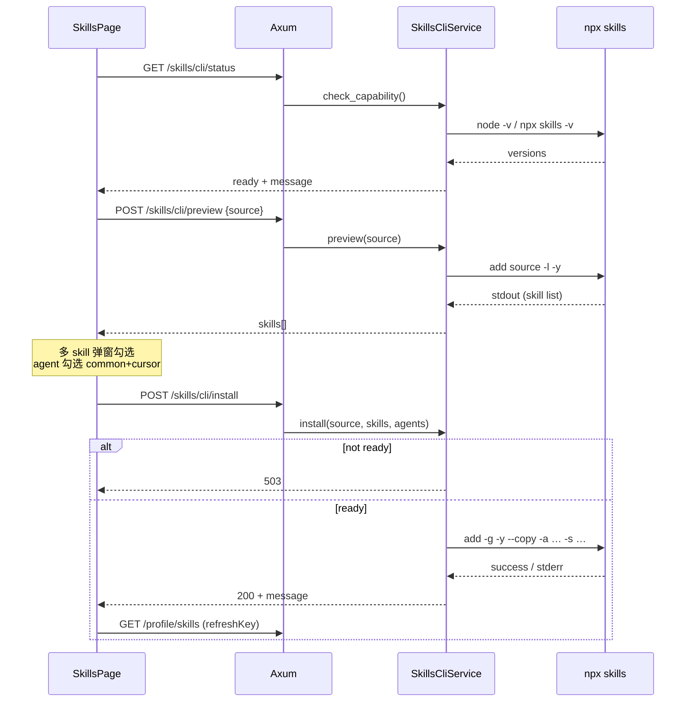

## 0. 术语约定


| 术语                      | 定义                                                           | 防冲突结论                                                 |
| ----------------------- | ------------------------------------------------------------ | ----------------------------------------------------- |
| **Skills CLI**          | 用户态 `npx skills` 命令行工具（vercel-labs/skills）                   | 不叫 `skills-cli` 指代 npm 包名，API 路径用 `skills/cli`        |
| **source**              | 用户输入的安装源：`owner/repo`、GitHub URL，或带 `@skill` 的单 skill 限定     | 与 git remote / plugin id 区分                           |
| **preview**             | 对 source 执行 `add -l`，解析可用 skill 列表，**不安装**                   | 不叫 search / find                                      |
| **agent scope**         | agent-manager 已注册的 skill 安装目标（`common` + `SUPPORTED_AGENTS`） | 与 npx skills 内部 `--agent` 值区分，经 **SkillsAgentMap** 映射 |
| **SkillsCliCapability** | 运行时是否具备 Node + npx + skills CLI                              | 用户拍板：仅校验 B（工具链），不校验 skill 与 agent 业务匹配                |


## 1. 决策与约束

### 需求摘要

- **做什么**：在 Skills 标签页增加「安装 Skill」流程——用户输入仓库或链接 → 预览仓库内 skill 列表（多选）→ 勾选要安装到的 agent scope（`common` + 已注册 agent）→ 后端调用 `npx skills add` 完成安装；安装前校验 Node / npx / skills CLI 可用。
- **为谁**：通过 Web 管理页维护 Cursor 运行时与用户 skill 目录的运维者。
- **成功标准**：
  - 输入合法 source 后，多 skill 仓库弹出可选列表；单 skill 仓库默认勾选唯一项并进入确认。
  - 勾选 agent 后安装，对应 `~/.agents/skills` / `~/.cursor/skills` 等目录出现新 skill，Skills 页刷新可见。
  - 运行时缺少 Node 或 `npx skills` 时，安装入口禁用并展示明确原因（非静默失败）。
- **明确不做**（用户拍板 + 范围收敛）：
  - **不做** `npx skills find` / skills.sh 搜索集成
  - **不做** `update` / `remove` / `list` CLI 的可视化（v1 仅 **preview + install**）
  - **不做** skill 包与 agent 的业务兼容性校验（只校验工具链 B）
  - **不做** 项目级（非 `-g`）安装；统一 **全局用户目录**（与现有 Skills 页 scope 一致）
  - **不做** Skills 删除能力扩展（Phase 1 原有「删除」若未实现仍不在本 feature 范围）

### 复杂度档位

走 **内部管理工具默认档位**。唯一偏离：需在 **Docker 运行时镜像** 补充 Node.js（当前 `debian:bookworm-slim` 无 Node，与 Paseo `npm install` 同类前置缺口一并补齐）。

### 关键决策（已拍板）


| 决策          | 选择                                                               | 换另一种做法编排层差异                                   |
| ----------- | ---------------------------------------------------------------- | --------------------------------------------- |
| 安装源输入       | 用户手输 **repo / URL**，无搜索                                          | 集成 find 需额外 API + 结果排序编排                      |
| 兼容性         | **Node + npx + skills CLI 可用**                                   | 业务匹配需维护 skill manifest 与 agent 矩阵             |
| Agent 勾选范围  | **agent-manager 已注册 scope**（`common` + `/api/agents` 列表）         | 全量 npx agents 需独立注册表与 UI                      |
| 多 skill 选择  | preview 解析 stdout；**≥2 个**时弹窗多选                                  | 全量 `--all` 无法选择性安装                            |
| 安装作用域       | `**npx skills add … -g -y --copy`** + 映射后的 `--agent` + `--skill` | 项目级 `-g` 不带则落 `.agents/skills` 项目目录，与现有读路径不一致 |
| Agent ID 映射 | **SkillsAgentMap**（见 2.1）                                        | 硬编码散落各层会导致扩展 agent 时漏改                        |


### SkillsAgentMap（agent-manager → npx `--agent`）


| agent-manager `id` | skill 根目录（现有 `host-fs`） | npx `--agent` 值 | 依据                                                                  |
| ------------------ | ----------------------- | --------------- | ------------------------------------------------------------------- |
| `common`           | `~/.agents/skills`      | `zed`           | vercel-labs/skills 文档：`zed` 等 agent 的 global 路径为 `~/.agents/skills` |
| `cursor`           | `~/.cursor/skills`      | `cursor`        | 同上：Cursor global → `~/.cursor/skills`                               |


扩展 `SUPPORTED_AGENTS` 时同步追加映射行；未映射的 agent **不可勾选**。

### 前置依赖

无 feature 级阻塞。运行时镜像需含 Node（本 feature 一并解决）。

## 2. 名词与编排

### 2.1 名词层

#### 现状

- Skills 页（`apps/web/src/pages/SkillsPage.tsx`）只 **列出 / 编辑** 本地 skill 文件；无安装入口。
- 后端 `GET /api/profile/skills` 等（`apps/server/src/main.rs`）经 `CursorProvider::list_skills` 读 `host-fs::agent_skills_root`。
- 命令执行已有 `host-proc::run_command_capture_with_env_timeout`（`crates/paseo-provider` 安装 Paseo 时复用）。
- Docker 运行时（`Dockerfile` runtime stage）**无 Node.js**；dev 环境宿主通常有 Node。

#### 变化

**新增对外契约**（均需登录，前缀 `/api/profile/skills/cli`）：

1. `**GET …/status`** — 查询 SkillsCliCapability

```json
// 200
{
  "ready": true,
  "node_version": "v22.x.x",
  "skills_cli_version": "x.y.z",
  "message": "Skills CLI 可用"
}

// 200（不可用仍 200，便于 UI 展示）
{
  "ready": false,
  "node_version": null,
  "skills_cli_version": null,
  "message": "未检测到 Node.js，请确认运行环境已安装 Node"
}
```

1. `**POST …/preview**` — 解析 source 内可用 skill（不安装）

```json
// 请求
{ "source": "vercel-labs/agent-skills" }

// 响应 200
{
  "source": "vercel-labs/agent-skills",
  "skills": [
    { "name": "web-design-guidelines", "description": "Review UI code for Web Interface Guidelines…" }
  ]
}

// 响应 400 — 空 source / 非法格式
{ "error": "请提供有效的仓库或链接" }

// 响应 502 — CLI 失败（网络、仓库不存在）
{ "error": "无法获取 skill 列表: …" }
```

实现侧执行：`npx skills add <source> -l -y`（`-y` 避免交互）；**stdout 解析** skill 名与描述（CLI 暂无 `--json` on `-l`）。

1. `**POST …/install`** — 按选择安装

```json
// 请求
{
  "source": "vercel-labs/agent-skills",
  "skills": ["web-design-guidelines", "writing-guidelines"],
  "agents": ["common", "cursor"]
}

// 响应 200
{
  "message": "已安装 2 个 skill 到 2 个 agent",
  "installed_skills": ["web-design-guidelines", "writing-guidelines"],
  "agents": ["common", "cursor"]
}

// 响应 400 — 未选 skill/agent、未知 agent id、source 空
{ "error": "…" }

// 响应 503 — SkillsCliCapability.ready == false
{ "error": "Skills CLI 不可用: …" }
```

CLI 编排（conceptual）：对每个选中的 agent-manager id，展开为 npx agent 名，执行一次：

`npx skills add <source> -g -y --copy --agent <mapped…> --skill <name…>`

（implement 可合并为单次命令传多个 `--agent` / `--skill`，以 CLI 支持为准。）

**不在范围内变更**

- 现有 `GET/PUT /api/profile/skills/:id` 读写语义不变。
- RuntimeCache 仍 **不缓存** Skills 列表（见 runtime-status-cache design）。

### 2.2 编排层

#### 主流程图




#### 现状

Skills 管理线性：**读目录 → 展示 → 编辑保存**。无 CLI 子流程。

#### 变化

1. **能力探测路径**：Skills 页加载时（或打开安装弹窗前）GET status；`ready == false` 时安装按钮 disabled + 展示 `message`。
2. **预览路径**：用户输入 source → POST preview → 若 `skills.length >= 2` 打开多选弹窗；若 `== 1` 默认勾选并展示确认；若 `== 0` 报错。
3. **安装路径**：POST install → 校验映射与 capability → 执行 CLI → 成功 toast → 触发 Skills 列表 refresh（现有 `refreshKey` / 重拉 GET）。
4. **镜像前置路径**（交付）：runtime Dockerfile 安装 Node.js（版本与 web-builder 对齐，如 Node 22），使 compose 部署下 status.ready 可为 true。

#### 流程级约束

- **超时**：preview / install 单次 CLI 超时上限 implement 设定（建议 120s），超时返回 504 或 502 + 明确 message。
- **并发**：同一用户连续 install 请求 **串行**（服务端 mutex 或单飞），避免并发写同一 skill 目录。
- **错误语义**：CLI 非零退出 → 保留 stderr 摘要返回客户端；**不**部分成功假装全成功（若 CLI 单次命令全有/全无则自然满足）。
- **幂等**：重复 install 同一 skill → 依赖 CLI 覆盖/跳过行为；UI 提示「已存在则更新」即可，不额外做 diff。
- **可观测**：install / preview 完成打 `info!(source, skill_count, agents, elapsed_ms)`。

### 2.3 挂载点清单


| 挂载位置                                  | 动作                                                  |
| ------------------------------------- | --------------------------------------------------- |
| `apps/server/src/main.rs` — `/api` 路由 | **新增** `/profile/skills/cli/status|preview|install` |
| `apps/web/src/pages/SkillsPage.tsx`   | **新增** 安装入口 + 弹窗流程（source 输入 / skill 多选 / agent 勾选） |
| `Dockerfile` — runtime stage          | **新增** Node.js 运行时依赖（Skills CLI 与现有 npm 类安装共用）      |


卸载 feature：移除上述路由、UI 入口与 Dockerfile Node 层即可；已安装的 skill 文件保留在用户目录（不自动清理）。

### 2.4 推进策略

1. **编排骨架**：`SkillsCliCapability` + status/preview/install 路由 stub；前端安装按钮 + 空弹窗壳。
  **退出信号**：编译通过；GET status 返回 JSON；UI 可见入口。
2. **计算节点 — 后端 CLI**：实现 capability 检测、preview 解析、install 命令编排 + SkillsAgentMap；Dockerfile 加 Node。
  **退出信号**：dev 下 status.ready=true；preview 对 `vercel-labs/agent-skills` 返回 ≥9 条；install 后目录有新文件夹。
3. **计算节点 — 前端交互**：source 表单、preview 加载态、多 skill Checklist、agent Checklist、install 提交与错误展示。
  **退出信号**：完整走通「输入 → 预览 → 勾选 → 安装 → 列表刷新」。
4. **联调验收**：`scripts/dev.bat` 或 compose 构建新镜像后手工走第 3 节场景。
  **退出信号**：第 3 节场景均可观察通过。

### 2.5 结构健康度与微重构

##### 评估

- **文件级 — `crates/cursor-provider/src/lib.rs`（~930 行）**：不宜继续堆 CLI 解析与 install 编排。
- **文件级 — `apps/web/src/pages/SkillsPage.tsx`（~230 行）**：弹窗 + 表单约 +80–120 行，可接受；若膨胀则拆 `SkillsInstallDialog` 组件文件。
- **目录级 — `crates/cursor-provider/src/`**：新增 `skills_cli.rs` 与 `lib.rs` 并列，由 `CursorProvider` 或独立 `SkillsCliService` 委托。

##### 结论：不做前置微重构

CLI 逻辑作为 **feature 主体** 落在新建 `crates/cursor-provider/src/skills_cli.rs`（或同级小模块），`lib.rs` 仅暴露 `AppState` 委托方法。

##### 超出范围的观察

- `apps/server/src/main.rs` 已 500+ 行 → 后续 `cs-refactor` 拆 routes；**本 feature 不阻塞**。
- preview 依赖 stdout 解析，CLI 若未来提供 `--json -l` 可替换解析层；**v1 不等待上游**。

## 3. 验收契约

### 关键场景清单


| #   | 输入 / 触发                                                 | 期望可观察结果                                                             |
| --- | ------------------------------------------------------- | ------------------------------------------------------------------- |
| 1   | GET `/api/profile/skills/cli/status`（dev，有 Node）        | `ready: true`，含 node / skills 版本字段                                  |
| 2   | 无 Node 的环境（或 mock 探测失败）                                 | `ready: false`，message 说明缺 Node 或 skills CLI                        |
| 3   | POST preview `{ "source": "vercel-labs/agent-skills" }` | 返回多条 `skills`，含 `name` + `description`                              |
| 4   | POST preview `{ "source": "" }`                         | 400 + error                                                         |
| 5   | Skills 页：preview 返回 ≥2 skill                            | 弹窗展示可勾选列表，默认全选或未选（implement 统一一种，acceptance 按 UI 实际为准）              |
| 6   | preview 返回 1 skill                                      | 无需多选列表或仅一项默认勾选，可继续选 agent 并安装                                       |
| 7   | install：选 1 skill + `common` + `cursor`                 | CLI 成功；`~/.agents/skills` 与 `~/.cursor/skills` 均出现对应目录；Skills 页刷新可见 |
| 8   | install：未选 agent 或未选 skill                              | 400，不执行 CLI                                                         |
| 9   | install 时 status.ready=false                            | 503，不执行 CLI                                                         |
| 10  | compose 新镜像部署后 status                                   | ready=true（验证 Dockerfile Node 层）                                    |


### 明确不做的反向核对

- **不应**出现 `POST /api/profile/skills/cli/find` 或调用 `npx skills find` 的后端路径。
- **不应**出现 `update` / `remove` 的安装向导 UI（v1）。
- **不应**在 install 请求中接受未在 SkillsAgentMap 注册的 agent id。
- preview **不应**写入 skill 目录（安装前目录 mtime 不变）。

## 4. 与项目级架构文档的关系

acceptance 后建议在 `ARCHITECTURE.md` §6.2 Skill 管理 补充：

- Phase 1 新增 **通过 Skills CLI 从远程仓库安装**（Web 向导 + `npx skills`）；
- 仍保留本地编辑；安装依赖运行时 Node。

本 feature 系统级可见变化：**3 个新 HTTP 端点** + **Skills 页 UI 入口** + **runtime 镜像含 Node**。

---

> **整体 review 提示**
>
> 1. 术语与 SkillsAgentMap 是否与现有 `common` / `cursor` scope 一致？
> 2. 「不做什么」（无 search、无 update/remove v1）是否准确？
> 3. preview 走 stdout 解析是否接受？
> 4. Dockerfile 加 Node 是否纳入本 feature 范围？
> 5. 验收场景是否覆盖边界？
>
> 确认后将 `status` 改为 `approved`，生成 checklist，再进入 `cs-feat-impl`。

